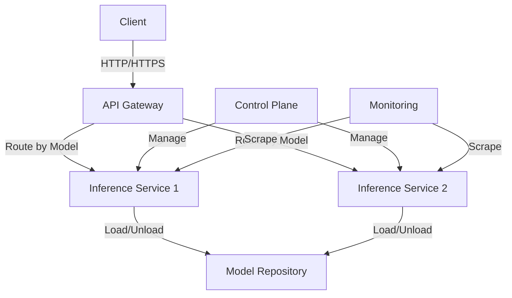

# Hybrid Orchestration for LLM Serving

A high-performance, scalable, and flexible LLM serving system with dynamic model loading and LoRA adapter support. This project implements a production-grade architecture that separates orchestration (Control Plane) from serving (Data Plane), enabling efficient resource utilization and dynamic scaling.

## 🌟 Features

- **Unified API Gateway**: OpenAI-compatible API endpoints for seamless integration
- **Dynamic Model Loading**: On-demand loading and unloading of LLM models
- **LoRA Adapter Support**: Runtime loading and switching of LoRA adapters
- **Horizontal Auto-scaling**: Dynamic scaling based on real-time metrics
- **Multi-tenant Support**: Isolated model instances with resource quotas
- **Metrics & Monitoring**: Built-in Prometheus metrics and Grafana dashboards
- **Kubernetes Native**: Designed to run on Kubernetes with custom resource definitions

## 🏗️ Architecture Overview

### High-Level Architecture



### Core Components

1. **Control Plane**
   - Manages system state and orchestration
   - Handles model lifecycle and scaling decisions
   - Implements custom Kubernetes controllers

2. **Data Plane**
   - Handles model inference
   - Manages local resources
   - Exposes metrics and health endpoints

## 🗂️ Directory Structure

```
inference-server/
├── control-plane/           # Control plane components
│   ├── lora_manager.py      # LoRA adapter management
│   └── autoscaler.py        # Auto-scaling controller
├── data-plane/
│   ├── gateway/            # API Gateway service
│   │   └── routing_service.py
│   └── inference/          # Core inference engine
│       ├── engine_api.py
│       └── sidecar_runtime.py
├── docker/                 # Dockerfiles
│   ├── Dockerfile.controller
│   └── Dockerfile.gateway
├── k8s/                    # Kubernetes manifests
├── tests/                  # Test suites
└── README.md               # This file
```

## Multi-tiered KV Cache

## 🚀 Getting Started

### Prerequisites

- Kubernetes cluster (v1.20+)
- NVIDIA GPU nodes with appropriate drivers
- kubectl and helm installed
- Container registry access

### Quick Start

1. **Clone the repository**
   ```bash
   git clone https://github.com/your-org/inference-server.git
   cd inference-server
   ```

2. **Build and push container images**
   ```bash
   docker build -f docker/Dockerfile.controller -t your-registry/controller:latest .
   docker build -f docker/Dockerfile.gateway -t your-registry/gateway:latest .
   docker push your-registry/controller:latest
   docker push your-registry/gateway:latest
   ```

3. **Deploy to Kubernetes**
   ```bash
   kubectl apply -f k8s/namespace.yaml
   kubectl apply -f k8s/
   ```

## 🛠️ Configuration

### Environment Variables

| Variable | Description | Default |
|----------|-------------|---------|
| `MODEL_REPOSITORY` | Path to model repository | `/models` |
| `MAX_CONCURRENT_REQUESTS` | Max concurrent requests per pod | `10` |
| `LOG_LEVEL` | Logging level | `INFO` |

### API Endpoints

- `POST /v1/chat/completions` - Chat completion endpoint
- `GET /metrics` - Prometheus metrics
- `POST /v1/adapters` - Manage LoRA adapters


## 📊 Monitoring

### Metrics

The system exposes the following metrics:

- `inference_requests_total`: Total number of inference requests
- `inference_latency_seconds`: Latency histogram
- `gpu_utilization`: GPU utilization percentage
- `model_load_time_seconds`: Time to load models

### Dashboards

Pre-configured Grafana dashboards are available in the `monitoring/` directory.

## 🤝 Contributing

Contributions are welcome! Please read our [Contributing Guidelines](CONTRIBUTING.md) for details.

## 📄 License

This project is licensed under the MIT License - see the [LICENSE](LICENSE) file for details.

## 📚 Resources

- [Architecture Decision Records](docs/adr/)
- [API Documentation](docs/api.md)
- [Performance Benchmarks](docs/benchmarks.md)

Dockerfile.engine

Inference Engine Image

Builds the heavy image containing the LLM framework (e.g., vLLM), CUDA drivers, PyTorch, and the base model weights, used by engine_api.py.

Dockerfile.sidecar

Sidecar Image

Builds the lightweight image containing the minimal Python dependencies needed for local monitoring and command handling (sidecar_runtime.py).

4. /k8s

All Kubernetes manifests required for declarative deployment and management.

Directory/File

Role

Description

/k8s/crds/LoraAdapter.yaml

LoRA CRD

Defines the Custom Resource Schema (kind: LoraAdapter) that the lora_manager.py controller watches to receive commands from users or external systems.

/k8s/01-rbac-roles.yaml

RBAC

Defines the necessary ServiceAccounts, Roles, and RoleBindings for the controllers and application Pods to interact with the Kubernetes API securely.

/k8s/02-gateway-deploy.yaml

Gateway Deployment

Standard Kubernetes Deployment and Service definition for the standalone Intelligent Router (routing_service.py). This is the entry point for all external user traffic.

/k8s/03-controller-deploy.yaml

Controller Deployment

Deployment for the Control Plane applications (lora_manager.py and autoscaler.py).

/k8s/llm-inference-deploy.yaml

Inference Deployment (Conceptual)

[Assuming a single-node deployment] This YAML defines the main LLM Inference Pod. It uses the Multi-Container Pod pattern to run both the heavy Inference Engine and the lightweight Sidecar Runtime simultaneously on a single GPU node.