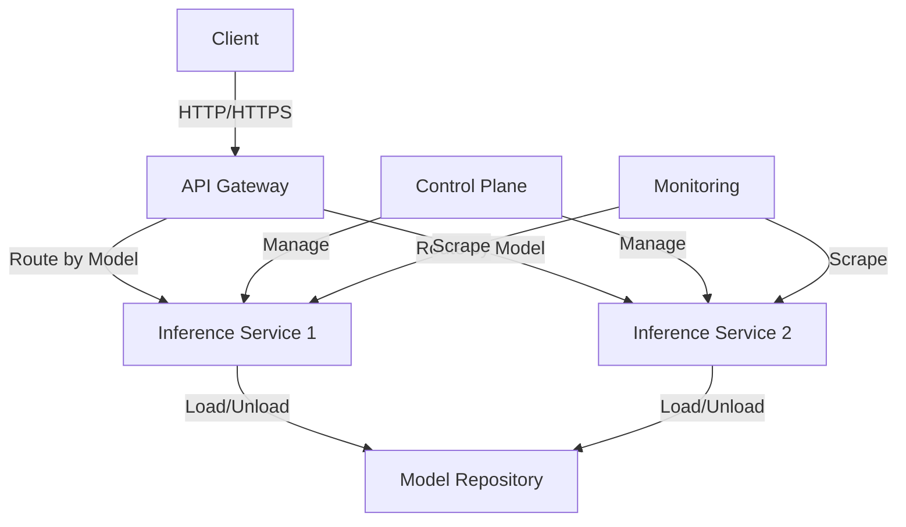

# Hybrid Orchestration for LLM Serving

A high-performance, scalable, and flexible LLM serving system with dynamic model loading and LoRA adapter support. This project implements a production-grade architecture that separates orchestration (Control Plane) from serving (Data Plane), enabling efficient resource utilization and dynamic scaling.

## Features

### OpenAI-Compatible Serving

The gateway exposes `/v1/chat/completions`, `/v1/completions`, and `/v1/models` — a drop-in replacement for the OpenAI API. Any client or benchmarking tool built against that interface works without modification. Requests accept the standard sampling parameters (temperature, top-p, top-k, presence and frequency penalties, seed) and map directly to vLLM's `SamplingParams`.

Streaming is supported end-to-end via server-sent events (SSE). The gateway maintains a dedicated HTTP client with an unbounded read timeout for streaming connections, preventing client-side failures on long inferences while still enforcing timeouts on non-streaming requests. This two-client design is what makes TTFT (time-to-first-token) measurement possible: the benchmarking dispatchers open a stream, record the timestamp of the first arriving chunk, and continue collecting inter-token intervals until the stream closes.

All request handling is fully asynchronous (FastAPI + httpx + asyncio). The engine wraps each incoming request in an `asyncio.Future` (non-streaming) or `asyncio.Queue` (streaming), decoupling request submission from result collection. This prevents thread exhaustion under high concurrency — critical when the concurrent dispatcher fires hundreds of simultaneous requests during throughput sweeps.

### Three-Service Architecture

The system separates concerns into three cooperating services, each with a distinct role:

- **Gateway** (port 8000) — Stateless HTTP router. Accepts client requests, resolves the target engine via `MODEL_SERVICE_MAP`, and forwards. Carries no GPU dependencies and can be scaled independently.
- **Engine** (port 8080) — GPU-bound inference worker. Wraps vLLM's `LLMEngine` for continuous batching, manages sampling, and exposes `/generate/stream` for the benchmarking clients. Enforces backpressure through a `max_pending` queue limit: when the pending request count reaches the threshold (default 200), subsequent requests receive HTTP 429 with a `Retry-After` header rather than being queued indefinitely — preventing memory exhaustion and unbounded latency under load.
- **Sidecar** (port 8001 HTTP + 50051 gRPC) — CPU-bound model and cache manager. Handles asynchronous model/adapter downloads from HuggingFace Hub, maintains an artifact registry with status tracking, and hosts the L1 KV cache. Communication with the engine uses gRPC for low-latency block-level KV transfers and HTTP for administrative operations (load, unload, registry queries).

This separation means the gateway stays lightweight and horizontally scalable, the engine owns the GPU without being burdened by download I/O or cache bookkeeping, and the sidecar can spill KV blocks to CPU DRAM (or Redis) without competing for GPU memory.

### LoRA Adapter Management

Adapters are loaded at runtime without restarting the engine. The `LoRAManager` implements a leader-follower deduplication pattern: when multiple concurrent requests need the same adapter, the first triggers the download while the others wait on a shared `asyncio.Event`. Once the sidecar confirms the adapter is resident (via registry polling), the manager calls `engine.add_lora()` to register it with vLLM. An LRU eviction policy removes the least-recently-used adapter when the configured `max_loras` capacity is reached.

Clients select adapters per request through `adapter_identifier` and `adapter_version` fields in the request body — following the same extension pattern as OpenAI's API. The engine tracks `adapter_swap_latency_s` for each request, making the overhead of hot-swapping directly measurable in benchmark results.

The sidecar maintains the adapter registry with state transitions (`downloading` -> `loaded` / `failed`), persisted to disk for durability across restarts. This decouples artifact availability from engine state, allowing multiple engines to share a single sidecar's cache.

### KV Cache Optimization

KV cache management operates at three tiers:

**Prefix caching** leverages vLLM's native implementation, toggled per experiment via `enable_prefix_caching` in the engine config. When enabled, vLLM's scheduler detects identical key-value prefixes across requests (e.g., shared system prompts) and reuses GPU blocks instead of recomputing them. The input length sweep experiment measures this directly by running identical conditions with caching on and off.

**L1 block cache** lives in the sidecar's CPU DRAM. It stores 1024 blocks of 128 KB each, managed by an LRU eviction policy with O(1) access tracking. The gRPC interface exposes five RPCs (`StoreBlock`, `LoadBlock`, `AllocateBlocks`, `GetFreeBlocks`, `FreeBlock`) for the engine to offload and retrieve KV blocks. Block size was chosen to stay well within gRPC's 16 MB message limit while aligning with vLLM's internal block granularity.

**L2 distributed cache** (scaffolded) extends capacity beyond a single sidecar using Redis. A `ConsistentHashRing` maps block hashes to Redis nodes via SHA-256 with virtual replicas, minimizing key reassignment when nodes join or leave. A `KVCacheWatcher` control-plane component tracks the active Redis topology via heartbeats.

**Engine-side offload** integrates with vLLM's plugin architecture through `SidecarOffloadingSpec`. The handler queues transfer jobs asynchronously and executes them during the scheduler's poll cycle, avoiding blocking the inference loop. Hash-based deduplication enables zero-copy prefix reuse across requests.

### Graceful Shutdown with Request Draining

Both the engine and gateway implement drain-aware shutdown to avoid dropping in-flight requests during deployments or scaling events. On SIGTERM, each service sets a drain flag that immediately rejects new requests with HTTP 503 and a `Retry-After` header, then waits for in-flight work to complete before tearing down. The engine polls its active request count (tracked via `request_futures` and `request_queues`) every 100ms, keeping the continuous batching loop alive so queued tokens continue generating. A configurable `drain_timeout` (default 30s, settable via `ENGINE_DRAIN_TIMEOUT` / `GATEWAY_DRAIN_TIMEOUT`) caps the wait — any requests still running after the deadline are cancelled and the process exits. The `/ready` endpoint returns 503 during drain so Kubernetes stops routing traffic, while `/health` stays 200 to prevent premature pod restarts. K8s manifests set `terminationGracePeriodSeconds` above the drain timeout to ensure the SIGKILL doesn't arrive before draining completes.

### Benchmarking Dispatchers

Three dispatch modes simulate different traffic patterns, each isolating a specific performance dimension:

**Sequential** sends one request at a time with an optional inter-request delay. With zero concurrency, it measures pure per-request latency — prefill time, decode time, and end-to-end — without queue contention or batching effects. This is the baseline that all other modes are compared against.

**Concurrent** fires N requests simultaneously via `asyncio.gather` with no semaphore throttling. A round-robin prompt selection strategy avoids artificial prefix-cache hits that would skew results. Every slot in the batch produces a `ResponseRecord` regardless of success or failure (a `SafeWrap` catches exceptions), so error rates under overload are captured alongside latency. This mode characterizes throughput ceilings, batching efficiency, and the engine's backpressure behavior as concurrency exceeds `max_pending`.

**Realistic** generates Poisson-distributed arrivals over a fixed duration. The dispatch loop sleeps for exponentially-distributed inter-arrival times (`random.expovariate(rps)`), randomly selects from a prompt pool, and fires async tasks. When the duration expires, in-flight requests drain with a timeout — timed-out tasks are cancelled and marked as errors, revealing queue capacity limits under sustained load. A post-hoc validation checks that the actual arrival count falls within 2-sigma of the expected Poisson count, flagging runs where system backpressure distorted the intended traffic pattern.

All dispatchers share a common base class defining `Prompt`, `ResponseRecord`, and a `warmup()` method that sends throwaway requests to stabilize CUDA kernels before measurement begins. The realistic dispatcher uses its own `warmup_timed()` variant that mirrors the Poisson traffic pattern of the actual measurement phase.

### Experiment Orchestration

Experiments are defined declaratively in YAML files. Each file specifies a set of **conditions** (parameter combinations like input length, output tokens, concurrency) organized into optional **condition groups** with per-group engine environment overrides. A single YAML can represent multi-dimensional sweeps — for example, the input length sweep defines 8 input sizes across 2 groups (prefix caching on/off), and the concurrency sweep overrides the dispatch concurrency per condition from 4 to 512.

The orchestrator handles the full lifecycle:

- **Engine restarts between groups** — When a new condition group requires different engine configuration (e.g., toggling prefix caching), the orchestrator updates the `.env` file, force-recreates the engine container via `docker compose`, and polls the `/generate/stream` endpoint until it responds. The original `.env` is restored after the experiment completes.
- **Incremental persistence** — Results are saved to disk after each condition completes, not at the end. The `--resume` flag loads existing results and skips completed conditions, so interrupted runs pick up where they left off.
- **Dry-run validation** (`--dry-run`) — Parses and validates the YAML, prints the condition execution plan (including restart points), and exits without sending any requests. Catches structural errors and invalid token lengths before committing infrastructure time.
- **Condition filtering** — `--only` and `--skip` accept comma-separated condition names for selective re-runs or focused iteration on subsets of a large experiment.

### Metrics Collection

Metrics are captured at three levels — client, server, and hardware — then aggregated per experimental condition.

**Client-side timing** is recorded at event boundaries during SSE streaming. TTFT is the delta between request start and the first chunk arrival. Inter-token latency (ITL) is captured as a list of consecutive chunk deltas. Decode time is derived as `E2E - TTFT`. Every request produces a `ResponseRecord` with these timings, the output token count, HTTP status, and any error — failed requests are never silently dropped.

**Server-side instrumentation** uses Prometheus histograms and counters exposed on the engine's `/metrics` endpoint: queue wait time, prefill duration, decode throughput (tokens/sec), and input/output token counts per request. A `SessionCollector` maintains a thread-safe ring buffer of per-request records for in-process aggregation. Queue depth is tracked both via vLLM's `num_requests_waiting` gauge and the collector's own increment/decrement operations, enabling cross-validation between the two sources.

**GPU monitoring** runs as an async background task polling `pynvml` every 2 seconds, sampling compute utilization, memory usage, and power draw. Running aggregates (average and max) are maintained in memory and exposed through the engine's `/metrics_summary` endpoint alongside the session collector's data. If `pynvml` initialization fails (e.g., no GPU available), the monitor degrades gracefully and reports `available: false`.

**Statistical aggregation** computes mean, p50, p90, and p99 over successful requests per condition. When multiple runs are configured, the orchestrator selects the median run to reduce noise from system variability. All per-request records are also persisted in JSON Lines format for offline re-analysis without re-running benchmarks.

## 🏗️ Architecture Overview

### High-Level Architecture


```mermaid
graph TD
    A[Client] -->|HTTP/HTTPS| B[API Gateway]
    B -->|Route by Model| C[Inference Service 1]
    B -->|Route by Model| D[Inference Service 2]
    C -->|Load/Unload| E[Model Repository]
    D -->|Load/Unload| E
    F[Control Plane] -->|Manage| C
    F -->|Manage| D
    G[Monitoring] -->|Scrape| C
    G -->|Scrape| D
```

### Core Components

1. **Control Plane**
   - Manages system state and orchestration
   - Handles model lifecycle and scaling decisions
   - Implements custom Kubernetes controllers

2. **Data Plane**
   - Handles model inference
   - Manages local resources
   - Exposes metrics and health endpoints

## 🗂️ Directory Structure

```
inference-server/
├── control-plane/           # Control plane components
│   ├── lora_manager.py      # LoRA adapter management
│   └── autoscaler.py        # Auto-scaling controller
├── data-plane/
│   ├── gateway/            # API Gateway service
│   │   └── routing_service.py
│   └── inference/          # Core inference engine
│       ├── engine_api.py
│       └── sidecar_runtime.py
├── docker/                 # Dockerfiles
│   ├── Dockerfile.controller
│   └── Dockerfile.gateway
├── k8s/                    # Kubernetes manifests
├── tests/                  # Test suites
└── README.md               # This file
```

## Multi-tiered KV Cache

## 🚀 Getting Started

### Prerequisites

- Kubernetes cluster (v1.20+)
- NVIDIA GPU nodes with appropriate drivers
- kubectl and helm installed
- Container registry access

### Quick Start

1. **Clone the repository**
   ```bash
   git clone https://github.com/your-org/inference-server.git
   cd inference-server
   ```

2. **Build and push container images**
   ```bash
   docker build -f docker/Dockerfile.controller -t your-registry/controller:latest .
   docker build -f docker/Dockerfile.gateway -t your-registry/gateway:latest .
   docker push your-registry/controller:latest
   docker push your-registry/gateway:latest
   ```

3. **Deploy to Kubernetes**
   ```bash
   kubectl apply -f k8s/namespace.yaml
   kubectl apply -f k8s/
   ```

## 🛠️ Configuration

### Environment Variables

| Variable | Description | Default |
|----------|-------------|---------|
| `MODEL_REPOSITORY` | Path to model repository | `/models` |
| `MAX_CONCURRENT_REQUESTS` | Max concurrent requests per pod | `10` |
| `LOG_LEVEL` | Logging level | `INFO` |

### API Endpoints

- `POST /v1/chat/completions` - Chat completion endpoint
- `GET /metrics` - Prometheus metrics
- `POST /v1/adapters` - Manage LoRA adapters


## 📊 Monitoring

### Metrics

The system exposes the following metrics:

- `inference_requests_total`: Total number of inference requests
- `inference_latency_seconds`: Latency histogram
- `gpu_utilization`: GPU utilization percentage
- `model_load_time_seconds`: Time to load models

### Dashboards

Pre-configured Grafana dashboards are available in the `monitoring/` directory.

## 🤝 Contributing

Contributions are welcome! Please read our [Contributing Guidelines](CONTRIBUTING.md) for details.

## 📄 License

This project is licensed under the MIT License - see the [LICENSE](LICENSE) file for details.

## 📚 Resources

- [Architecture Decision Records](docs/adr/)
- [API Documentation](docs/api.md)
- [Performance Benchmarks](docs/benchmarks.md)
- [Benchmark Results Report](docs/benchmark_report.md) — Detailed performance analysis with plots and theoretical background

Dockerfile.engine

Inference Engine Image

Builds the heavy image containing the LLM framework (e.g., vLLM), CUDA drivers, PyTorch, and the base model weights, used by engine_api.py.

Dockerfile.sidecar

Sidecar Image

Builds the lightweight image containing the minimal Python dependencies needed for local monitoring and command handling (sidecar_runtime.py).

4. /k8s

All Kubernetes manifests required for declarative deployment and management.

Directory/File

Role

Description

/k8s/crds/LoraAdapter.yaml

LoRA CRD

Defines the Custom Resource Schema (kind: LoraAdapter) that the lora_manager.py controller watches to receive commands from users or external systems.

/k8s/01-rbac-roles.yaml

RBAC

Defines the necessary ServiceAccounts, Roles, and RoleBindings for the controllers and application Pods to interact with the Kubernetes API securely.

/k8s/02-gateway-deploy.yaml

Gateway Deployment

Standard Kubernetes Deployment and Service definition for the standalone Intelligent Router (routing_service.py). This is the entry point for all external user traffic.

/k8s/03-controller-deploy.yaml

Controller Deployment

Deployment for the Control Plane applications (lora_manager.py and autoscaler.py).

/k8s/llm-inference-deploy.yaml

Inference Deployment (Conceptual)

[Assuming a single-node deployment] This YAML defines the main LLM Inference Pod. It uses the Multi-Container Pod pattern to run both the heavy Inference Engine and the lightweight Sidecar Runtime simultaneously on a single GPU node.