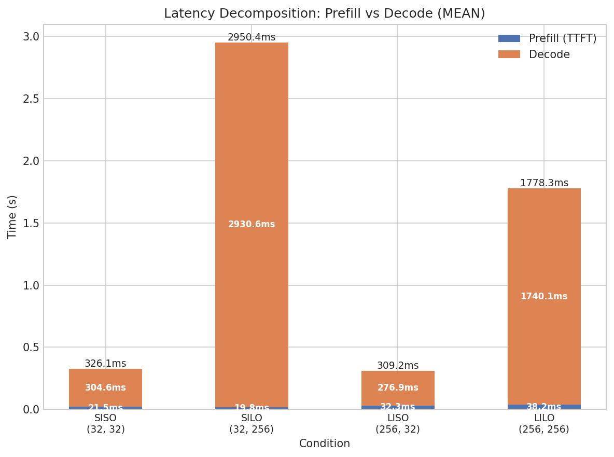
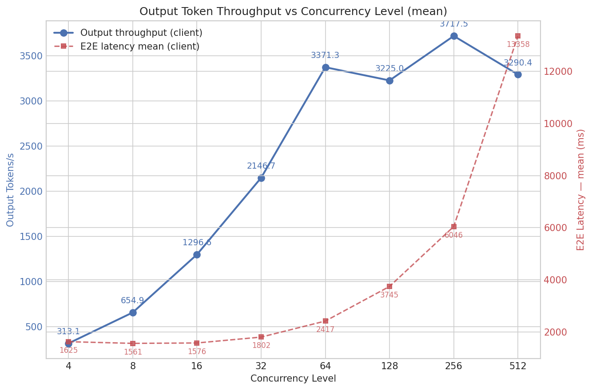
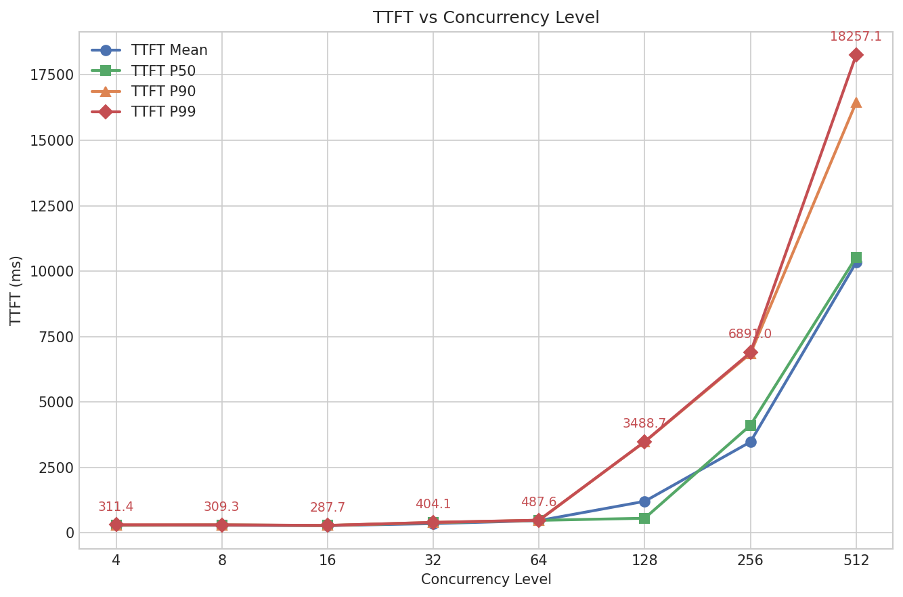
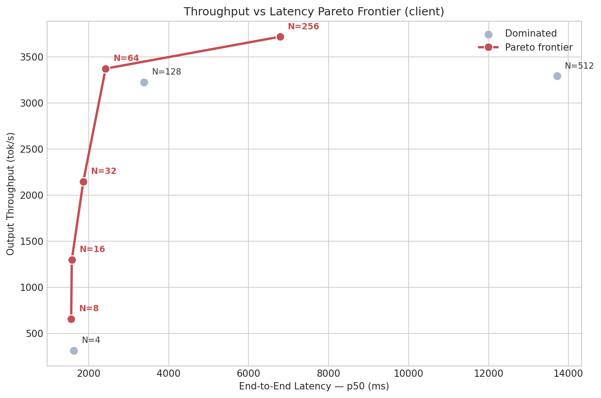
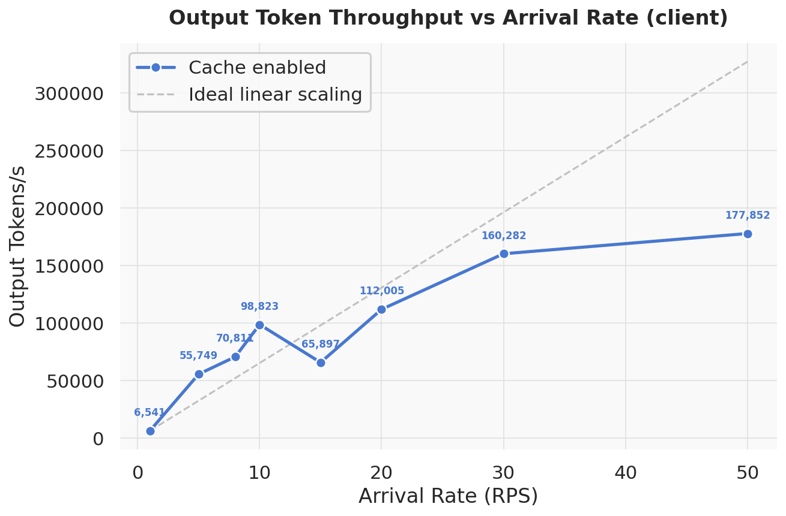
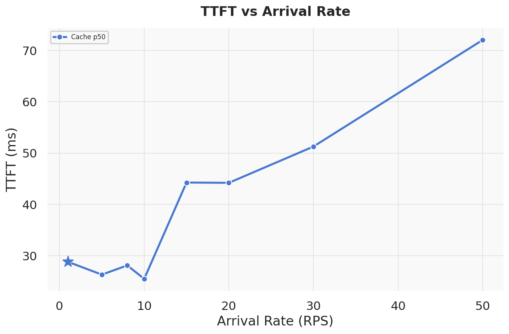

# Inference Engine — Performance Analysis

## Introduction

This report presents a systematic performance analysis of a custom LLM inference server built on top of [vLLM](https://github.com/vllm-project/vllm). The goal is to characterize the server's behavior across the dimensions that matter most in production: **latency**, **throughput**, and **scaling under load**.

Rather than running a single benchmark and reporting a number, we designed five experiments organized around three *dispatch modes* — each isolating a different aspect of serving performance. Every experiment starts from a hypothesis grounded in how transformer inference actually works, and the results either confirm or challenge that expectation.

### Test environment

| Component | Details |
|-----------|---------|
| Model | Qwen2-0.5B |
| Framework | vLLM (continuous batching) |
| GPU | Single NVIDIA GPU |
| Dispatch modes | Sequential, Concurrent, Realistic (Poisson) |
| Metrics source | Client-side (httpx streaming) + server-side (engine `/metrics_summary`) |

---

## The Three Dispatch Modes

Benchmarking an inference server is not as simple as "send requests, measure time." The way requests arrive fundamentally changes what you're measuring. We use three dispatch modes, each designed to answer a different question:

### Sequential — "How fast is one request?"

Requests are sent one at a time: the next request only starts after the previous one completes. This eliminates all contention — no batching, no queuing, no resource sharing.

**Why it matters:** Sequential mode reveals the engine's *baseline* latency. Think of it as a doctor seeing one patient at a time — you learn exactly how long each visit takes without the noise of a busy waiting room. This is the floor; real-world latency can only be equal or worse.

**Experiments:** Latency Composition, Input Length Sweep, Decode Time vs Output Length.

### Concurrent — "How does the engine scale under parallel load?"

A fixed number of requests are fired simultaneously using `asyncio.gather()`. The concurrency level (N) is varied across conditions, from N=4 to N=512.

**Why it matters:** Concurrent mode stresses the engine's batching and scheduling. Think of it as a restaurant kitchen receiving N orders at once — at low N the kitchen handles it efficiently; at high N, orders back up and wait times explode. This reveals the throughput ceiling and the point where latency becomes unacceptable.

**Experiments:** Concurrency Sweep (throughput, TTFT, and Pareto frontier).

### Realistic — "How does the engine behave in production?"

Requests arrive following a Poisson process at a configurable rate (λ requests/second). Inter-arrival times are exponentially distributed, creating the natural burstiness of real traffic.

**Why it matters:** Neither sequential nor concurrent dispatch reflects production traffic. In reality, requests arrive randomly — sometimes clustered, sometimes sparse. Think of it as a hospital emergency room: patients arrive unpredictably, and the system must handle bursts without collapsing. This mode reveals queuing dynamics and operational saturation limits.

**Experiments:** Arrival Rate Sweep (throughput, queue depth, TTFT under increasing λ).

---

## Key Metrics

Before diving into results, here's what each metric captures:

| Metric | What it measures | Analogy |
|--------|-----------------|---------|
| **TTFT** (Time To First Token) | Time from sending the request to receiving the first output token. Reflects the *prefill* phase — processing the entire input prompt. | How long you wait before the waiter starts bringing dishes. |
| **Decode Time** | Time from the first output token to the last. This is the *autoregressive generation* phase. | How long it takes to serve all courses after the first one arrives. |
| **ITL** (Inter-Token Latency) | Average time between consecutive output tokens during decoding. | The gap between each course arriving at your table. |
| **E2E** (End-to-End) | Total time from request start to completion. E2E = TTFT + Decode Time. | Total time from ordering to finishing dessert. |
| **Throughput** (tok/s) | Output tokens generated per second across all concurrent requests. | How many dishes the kitchen produces per hour. |

---

## Experiment 1 — Latency Composition

**Dispatch mode:** Sequential

### Hypothesis

End-to-end latency is composed of two distinct phases: *prefill* (measured by TTFT) and *decode*. We expect decode time to dominate when output length >> input length, and prefill to become significant only for long inputs.

### Theoretical background

Transformer inference has two fundamentally different phases:

1. **Prefill (prompt processing):** The engine processes the entire input prompt in a single forward pass. All input tokens are processed in parallel through the self-attention layers, and the Key-Value (KV) cache is populated. The compute cost grows with input length, but because it's a single parallelized pass, wall-clock time is relatively small for short inputs.

2. **Decode (token generation):** Output tokens are generated one at a time, autoregressively. Each new token requires a full forward pass that reads the entire KV cache (all previous keys and values). This makes each decode step memory-bandwidth-bound rather than compute-bound. The total decode time is approximately `output_tokens × time_per_token`.

This means E2E latency decomposes as: **E2E ≈ TTFT + (output_tokens × ITL)**. Increasing input length grows TTFT; increasing output length grows decode time.

### Setup

Four input/output size combinations, tested under zero contention (sequential dispatch):

| Condition | Input tokens | Output tokens | What it tests |
|-----------|:-----------:|:------------:|---------------|
| SISO (Short In, Short Out) | 32 | 32 | Baseline — minimal work in both phases |
| SILO (Short In, Long Out) | 32 | 256 | Decode-dominated workload |
| LISO (Long In, Short Out) | 256 | 32 | Prefill-dominated workload |
| LILO (Long In, Long Out) | 256 | 256 | Both phases stressed |

### Results



**Key observations:**

- **SISO (32→32):** E2E = 326ms. Prefill (TTFT) is 21ms — just 6.6% of total time. Even with minimal output, decode dominates because autoregressive generation has a high per-token overhead.

- **SILO (32→256):** E2E = 2,950ms. Decode time is 2,931ms (99.3%). TTFT remains at 20ms — confirming that prefill cost is independent of output length. The ~9x increase in output tokens (32→256) produces a ~9.6x increase in decode time, consistent with linear scaling.

- **LISO (256→32):** E2E = 309ms. TTFT rises from 21ms to 32ms (a 52% increase for 8x more input tokens). Decode time (277ms) is slightly lower than SISO (305ms) — within natural variance. This shows that prefill cost exists but is dwarfed by decode for short outputs.

- **LILO (256→256):** E2E = 1,778ms. Both phases contribute: 38ms prefill + 1,740ms decode. The decode time here is lower than SILO despite the same output length, likely due to measurement variance across runs.

### Key takeaway

**Decode time dominates end-to-end latency.** For typical workloads, the cost of generating output tokens far exceeds the cost of processing the input prompt. Optimizing decode throughput (ITL) has the highest impact on user-perceived latency.

---

## Experiment 2 — TTFT vs Input Length

**Dispatch mode:** Sequential

> **Status: Work in Progress** — The full input length sweep (3,840 to 12,960 tokens) needs to be re-run. Current data shown below covers a partial range.

### Hypothesis

TTFT should scale approximately linearly with input token count. Self-attention has O(n²) computational complexity, but for the sequence lengths tested here, the prefill phase is *memory-bandwidth-bound* on the GPU (reading/writing the KV cache), making the wall-clock time grow closer to O(n).

With *prefix caching* enabled, repeated prompts that share a common prefix should show significantly lower TTFT on subsequent runs, as the KV cache for the shared prefix is reused rather than recomputed.

### Theoretical background

During prefill, the engine computes attention over all input tokens:

```
Attention(Q, K, V) = softmax(QK^T / √d_k) V
```

The QK^T matrix is n×n where n is the sequence length, giving O(n²) FLOPs. However, modern GPUs are fast enough at matrix multiplication that for sequences up to ~16K tokens, the bottleneck is memory bandwidth (moving the KV tensors between GPU HBM and SRAM), not raw compute. This makes TTFT scale roughly linearly in practice.

**Prefix caching** exploits a key property: if two requests share the first P tokens of their prompt, their KV cache entries for those P tokens are identical. The engine can store and reuse these blocks, skipping the prefill computation for the shared prefix entirely. The TTFT then depends only on the *novel* suffix length.

### Results (partial)

#### TTFT vs Input Length (no cache)


> **Note:** This plot currently only shows data at ~3,840 input tokens. The full sweep across 3,840 / 5,760 / 8,640 / 12,960 tokens is pending. Once complete, we expect to see a linear trend confirming the O(n) wall-clock behavior.

#### Prefix Caching Impact


Even with only two data points (3,840 and 5,760 tokens), the prefix caching comparison shows a clear gap: **cache-enabled TTFT is consistently lower** than cache-disabled, and the gap widens with input length — consistent with the theory that longer shared prefixes yield larger savings.

### Key takeaway

Prefix caching reduces TTFT, with greater benefit at longer input lengths. Full sweep data is needed to confirm the scaling slope.

---

## Experiment 3 — Decode Time vs Output Length

**Dispatch mode:** Sequential

> **Status: Work in Progress** — Experiment defined but plots not yet generated.

### Hypothesis

Decode time should scale linearly with the number of output tokens. Each output token requires exactly one forward pass through the model, and the per-token cost (ITL) should remain roughly constant regardless of how many tokens have been generated so far.

### Theoretical background

During the decode phase, the engine generates tokens autoregressively:

1. Take the most recent token (or the last prefill output) as input
2. Run a forward pass, reading the full KV cache
3. Sample the next token from the output logits
4. Append the new token's KV entries to the cache
5. Repeat until `max_tokens` is reached or EOS is generated

Each step is memory-bandwidth-bound: the model must read the entire KV cache (which grows by one entry per step) and all model weights. For small models like Qwen2-0.5B, the KV cache is small relative to GPU memory, so the per-token cost remains nearly constant across output lengths.

Expected result: **decode_time ≈ output_tokens × ITL**, where ITL is approximately constant (~9-10ms based on the latency composition data).

### Setup

| Condition | Input tokens | Output tokens |
|-----------|:-----------:|:------------:|
| output_3840 | 32 | 3,840 |
| output_5760 | 32 | 5,760 |
| output_8640 | 32 | 8,640 |
| output_12960 | 32 | 12,960 |

### Results

*Plots pending — experiment needs to be run and plotted.*

Based on the latency composition data, we expect an ITL of ~9.2ms/token (the mean ITL measured in SILO), which would predict:
- 3,840 tokens → ~35.3 seconds
- 5,760 tokens → ~53.0 seconds  
- 8,640 tokens → ~79.5 seconds
- 12,960 tokens → ~119.2 seconds

### Key takeaway

*Pending experimental validation.* We expect a near-perfect linear relationship between output token count and decode time.

---

## Experiment 4 — Concurrency Sweep

**Dispatch mode:** Concurrent

### Overview

This is the richest experiment: a single sweep across concurrency levels N = 4, 8, 16, 32, 64, 128, 256, 512 produces three complementary views of the throughput–latency tradeoff.

**Setup:** Fixed input (32 tokens) and output (128 tokens) across all conditions. Only the concurrency level varies.

---

### 4a. Throughput vs Concurrency

#### Hypothesis

Throughput (output tokens/second) should increase with concurrency as the GPU batches more requests together, then plateau or decline when resources saturate.

#### Theoretical background

vLLM uses *continuous batching*: rather than processing requests one by one, it packs multiple requests into a single GPU batch. Each decode step processes all active requests simultaneously. More concurrent requests → more tokens generated per forward pass → higher throughput.

However, throughput cannot grow indefinitely:

- **GPU compute** becomes the bottleneck when the batch size is large enough to saturate the tensor cores
- **GPU memory** limits how many KV caches can be held simultaneously
- **Scheduling overhead** grows as the engine must manage more in-flight requests

Beyond the saturation point, adding more concurrent requests increases queuing delay without improving throughput.

#### Results



| Concurrency | Throughput (tok/s) | E2E Latency (mean) |
|:-----------:|:-----------------:|:------------------:|
| 4 | 313 | 1,625ms |
| 8 | 655 | 1,561ms |
| 16 | 1,297 | 1,576ms |
| 32 | 2,147 | 1,802ms |
| 64 | 3,371 | 2,417ms |
| 128 | 3,225 | 3,745ms |
| 256 | 3,718 | 6,046ms |
| 512 | 3,290 | 13,358ms |

**Analysis:**

- **Linear scaling region (N=4→64):** Throughput grows nearly linearly, from 313 to 3,371 tok/s — a 10.8x increase for a 16x increase in concurrency. The GPU efficiently batches these requests.
- **Saturation plateau (N=64→256):** Throughput flattens around 3,200–3,700 tok/s. Adding more requests doesn't produce more tokens per second — the GPU is fully utilized.
- **Degradation (N=512+):** Throughput drops to 3,290 tok/s while E2E latency explodes to 13.4 seconds. The engine spends more time managing queues and context-switching than computing.
- **N=1024:** All requests failed (throughput = 0), indicating complete queue overflow.

#### Key takeaway

**Peak throughput is ~3,700 tok/s at N=256**, but this comes at 6x the latency of N=16. The practical sweet spot depends on the latency SLO.

---

### 4b. TTFT vs Concurrency

#### Hypothesis

TTFT should remain stable at low concurrency (the GPU can interleave prefill steps between decode batches) and then grow sharply as concurrent requests compete for prefill compute time.

#### Theoretical background

In vLLM's continuous batching scheduler, new requests must wait for a prefill slot. At low concurrency, the scheduler can interleave prefill operations between decode steps with minimal delay. As concurrency grows:

1. More requests arrive needing prefill simultaneously
2. The scheduler can only prefill a limited number per iteration
3. Remaining requests queue, increasing their TTFT
4. The gap between p50 and p99 widens — *tail latency explodes* before median latency moves

The p99/p50 divergence is the earliest warning sign of overload.

#### Results



| Concurrency | TTFT mean | TTFT p50 | TTFT p99 | p99/p50 ratio |
|:-----------:|:---------:|:--------:|:--------:|:-------------:|
| 4 | 295ms | 292ms | 311ms | 1.07x |
| 8 | 292ms | 307ms | 309ms | 1.01x |
| 16 | 280ms | 285ms | 288ms | 1.01x |
| 32 | 358ms | 389ms | 404ms | 1.04x |
| 64 | 472ms | 483ms | 488ms | 1.01x |
| 128 | 1,208ms | 559ms | 3,489ms | 6.24x |
| 256 | 3,478ms | 2,617ms | 6,891ms | 2.63x |
| 512 | 10,332ms | 10,575ms | 18,257ms | 1.73x |

**Analysis:**

- **Stable region (N=4→64):** TTFT stays between 280–472ms. The scheduler handles prefill requests efficiently.
- **Inflection point (N=128):** Mean TTFT jumps to 1.2 seconds, but the critical signal is the p99 at 3.5 seconds — a **6.2x p99/p50 ratio**. Half the requests are still fast, but the unlucky ones wait in a long queue.
- **Collapse (N=256→512):** Even the median TTFT exceeds 2.6 seconds. At N=512, the average user waits 10 seconds for the first token.

#### Key takeaway

**TTFT remains acceptable up to N=64.** Beyond that, tail latency (p99) is the first metric to degrade — monitor p99 TTFT as the primary overload signal.

---

### 4c. Throughput–Latency Pareto Frontier

#### Hypothesis

There exists a set of *Pareto-optimal* operating points where no configuration achieves higher throughput without also increasing latency. The "knee" of this frontier represents the best practical tradeoff.

#### Theoretical background

A Pareto frontier is a concept from multi-objective optimization. Given two competing objectives — maximize throughput and minimize latency — a configuration is *Pareto-optimal* if no other configuration is strictly better on both metrics. Configurations below/right of the frontier are *dominated* (worse throughput AND worse latency than some frontier point).

The "knee" of the frontier is the point of maximum curvature — where small increases in concurrency start producing large latency increases for diminishing throughput gains.

#### Results



**Analysis:**

- The frontier runs from N=4 (low throughput, low latency) to N=256 (peak throughput, high latency)
- **The knee is at N=64:** throughput reaches 3,371 tok/s at 2.4s E2E. Moving to N=128 barely increases throughput (3,225 tok/s — actually *lower*) but latency jumps to 3.7s.
- N=128 and N=512 are *dominated* points — worse throughput AND worse latency than N=256.
- N=64 delivers **91% of peak throughput at 40% of peak latency**, making it the recommended operating point.

#### Key takeaway

**Optimal operating point: N=64.** It captures most of the throughput gains while keeping latency under control. Running at N=256 gains only 10% more throughput but costs 2.5x the latency.

---

## Experiment 5 — Arrival Rate Sweep

**Dispatch mode:** Realistic (Poisson)

### Overview

This experiment simulates production traffic by sending requests at increasing Poisson arrival rates (λ = 1, 5, 8, 10, 15, 20, 30, 50 RPS). Each test runs for 150 seconds with a 60-second drain period. Two configurations are compared: prefix caching disabled vs enabled.

---

### 5a. Throughput vs Arrival Rate

#### Hypothesis

Below the server's capacity, throughput should scale linearly with arrival rate (every request gets served promptly). Above capacity, throughput should plateau — the server is always busy but can't go faster.

#### Theoretical background

In queuing theory, a server with service rate μ behaves differently below and above its capacity:

- **λ < μ (under-capacity):** The queue is stable, throughput ≈ λ, and latency is low. The system has idle time between requests.
- **λ ≈ μ (at capacity):** The queue is barely stable, throughput ≈ μ, and latency starts growing due to occasional bursts.
- **λ > μ (over-capacity):** The queue grows without bound, throughput = μ (capped), and latency increases over time.

The deviation from the "ideal linear scaling" line reveals the saturation point.

#### Results



> **Note:** The absolute throughput values in this plot appear higher than expected and are under validation. The *relative* behavior (linear scaling → saturation) is the primary finding.

**Analysis:**

- At low arrival rates (1–10 RPS), throughput tracks the ideal linear scaling line closely — the server has spare capacity.
- Between 15–30 RPS, throughput begins to deviate from the ideal line, indicating the server is approaching saturation.
- At 50 RPS, throughput flattens — the server is producing tokens as fast as it can regardless of how many requests arrive.
- Cache-enabled and cache-disabled curves show similar throughput profiles, which is expected since output tokens (not cached prefix reuse) dominate the workload at 32 output tokens.

---

### 5b. TTFT vs Arrival Rate

#### Hypothesis

TTFT should remain flat below the saturation point, then increase as queuing delays accumulate. The p99 percentile should diverge from the p50 first — the "canary in the coal mine" for overload.

#### Theoretical background

Little's Law relates queue length (L), arrival rate (λ), and wait time (W):

**L = λ × W**

As λ approaches the service rate μ, the expected queue length grows. Since TTFT includes any queuing delay before prefill begins, TTFT is directly affected by queue buildup. The p99 is sensitive to burst arrivals (multiple requests arriving close together by chance), which is why it diverges before the median.

#### Results



**Analysis:**

- At low arrival rates (1–10 RPS), both p50 and p99 TTFT remain below 50ms — negligible queuing.
- At 15–20 RPS, the p99 starts climbing (from ~70ms to ~120ms) while the p50 barely moves — burst arrivals cause occasional queuing.
- At 50 RPS, p50 TTFT reaches ~72ms and p99 reaches ~179ms — consistent, moderate queuing under sustained load.
- The cache-disabled series shows lower TTFT at some arrival rates, which may seem counterintuitive. This is an artifact of the small input/output sizes used (32 tokens) — prefix caching overhead exceeds its benefit when prefill is already very fast.

---

### 5c. Queue Depth vs Arrival Rate

> **Status: Work in Progress** — Queue depth metrics are currently returning zero due to a known instrumentation bug in the engine's `/metrics_summary` endpoint. This experiment is defined and ready to re-run once the metrics are fixed.

#### Hypothesis (for future validation)

Maximum queue depth should grow super-linearly as arrival rate approaches and exceeds the service rate. At λ << μ, the queue should be empty most of the time. At λ ≈ μ, short transient queues form during bursts. At λ > μ, the queue grows continuously.


*All values are zero due to the metrics bug — this plot will be updated once the issue is resolved.*

---

## Summary of Findings

| Experiment | Key finding | Critical number |
|-----------|-------------|-----------------|
| Latency Composition | Decode dominates E2E latency; prefill is negligible for short inputs | Decode = 99.3% of E2E for 32→256 tokens |
| TTFT vs Input Length | *(Work in progress)* Prefix caching reduces TTFT; gap widens with input length | — |
| Decode Time vs Output | *(Work in progress)* Expected ~9.2ms/token linear scaling | — |
| Throughput vs Concurrency | Throughput scales linearly up to N=64, then saturates | Peak: 3,718 tok/s at N=256 |
| TTFT vs Concurrency | Tail latency (p99) explodes at N=128; median follows at N=256 | p99/p50 ratio = 6.2x at N=128 |
| Pareto Frontier | N=64 is the optimal operating point (91% peak throughput, 40% peak latency) | 3,371 tok/s at 2.4s E2E |
| Throughput vs Arrival Rate | Linear scaling up to ~10 RPS, saturation beyond 30 RPS | — |
| TTFT vs Arrival Rate | p99 TTFT diverges from p50 starting at 15 RPS | p99 = 179ms at 50 RPS |

---

## Reproducibility

All experiments are fully reproducible from their YAML definitions. See [`benchmarks/experiments.md`](../benchmarks/experiments.md) for:

- YAML schema and experiment format
- Running instructions with CLI options (`--restart`, `--resume`, `--dry-run`)
- Plotting commands for each experiment
- Output JSON format specification

```bash
# Example: run the concurrency sweep
python3 -m benchmarks.experiment_orchestrator \
  benchmarks/experiments/concurrent/concurrency_sweep.yaml \
  --engine-url http://localhost:8080

# Example: plot throughput vs concurrency
python3 -m benchmarks.plotting.concurrency_plotter throughput
```
